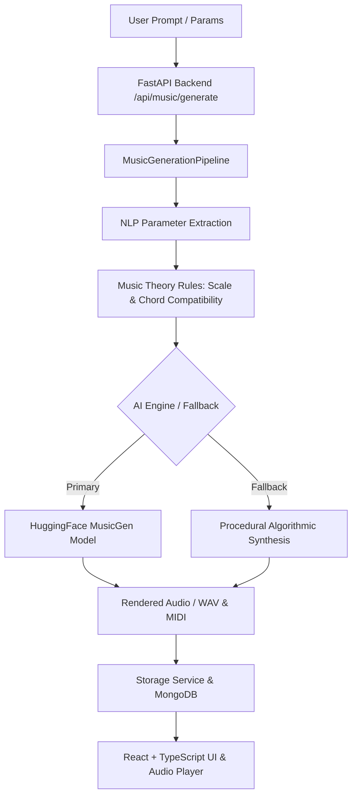

# AI-Powered Personal Music Composer — Architecture Documentation

## Overview
This platform combines Generative AI, Digital Signal Processing (DSP), Rule-based Music Theory, FastAPI (Python), MongoDB, and a React + TypeScript frontend.

## Core Modules
- **FastAPI Backend**: JWT Authentication, Project CRUD, Background tasks for music generation, Audio Signal Analyzer (`librosa`), Personalization Engine.
- **AI Services**:
  - `MusicGenerationPipeline`: NLP text parsing and parameter extraction.
  - `MusicGenService`: Meta MusicGen integration.
  - `AlgorithmicComposer`: Rule-based procedural audio synthesis (zero-GPU fallback).
  - `RecommendationEngine`: Personalization based on generation history & genre/mood heuristics.
  - `AudioAnalyzer`: Extraction of BPM, Key, Energy, and Mood from uploaded tracks.
- **React Frontend**: Dark futuristic studio design system with Glassmorphism, Audio Player with Waveform Visualizer, Studio Workspace DAW grid, Conversational AI Assistant.
